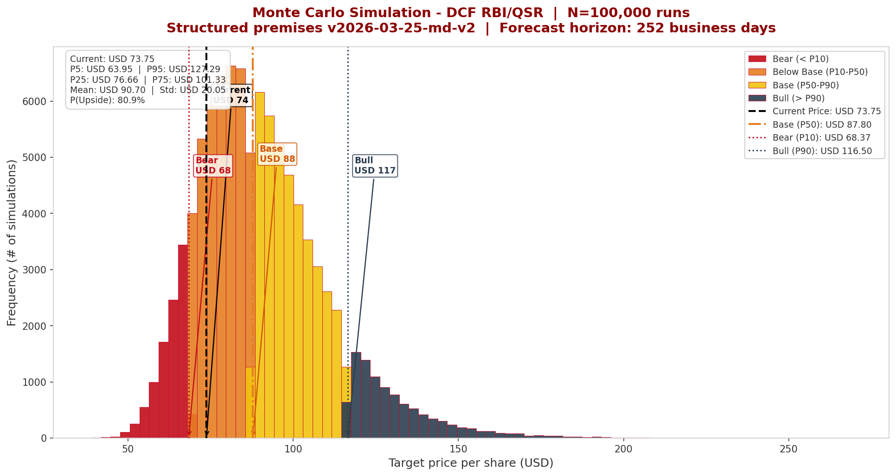
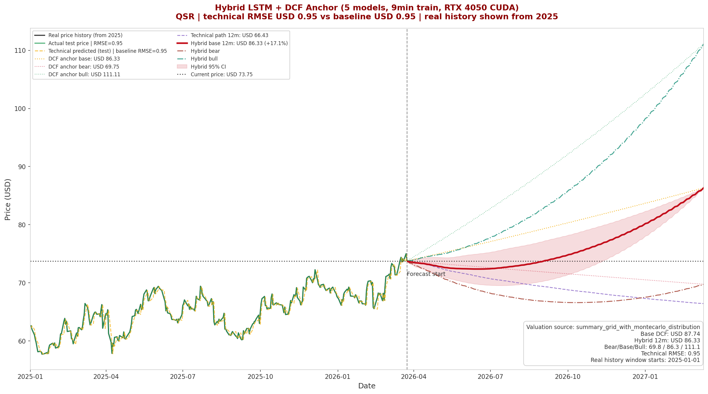

# QSR Hybrid Valuation - Constellation Challenge

A fully documented equity research and quantitative modeling project on Restaurant Brands International (`QSR`), built for a competition-style valuation case and structured as a professional portfolio repository.

This project combines a fundamental valuation stack with a technical overlay. The core investment view comes from a discounted cash flow framework, structured scenario analysis, sensitivity testing, and Monte Carlo simulation. On top of that, the repository includes a standalone LSTM experiment and a hybrid LSTM + valuation model that treats machine learning as a pathing and timing overlay around a fundamental anchor rather than as the source of the investment thesis.

## Investment Thesis

QSR offers an attractive fundamental risk-reward profile under a disciplined base case. The valuation framework points to a **12-month official target price of USD 86.33/share**, versus a reference market price of **USD 73.75/share**, implying **+17.1% upside** in the model snapshot dated **March 25, 2026**.

The thesis is driven by moderate operating growth, resilient cash generation, and valuation support under explicit bear, base, and bull scenarios. The technical models are included to analyze trajectory and dispersion around the fundamental target, but the investment call remains firmly rooted in the valuation framework.

## Key Results

- **Official target price:** `USD 86.33/share`
- **Bear / Base / Bull:** `USD 69.75 / 86.33 / 111.11`
- **Monte Carlo median (P50):** `USD 87.80`
- **Monte Carlo upside probability:** `80.9%`
- **Hybrid model insight:** technical pathing can remain below the anchor intra-horizon while still converging to the fundamental target by month 12

## Repository Structure

```text
qsr-valuation-hybrid-model-constellation-challenge/
|-- data/
|   |-- raw/
|   `-- processed/
|-- notebooks/
|-- models/
|-- valuation/
|-- monte_carlo/
|-- lstm/
|-- hybrid/
|-- outputs/
|-- figures/
|-- docs/
|-- run_pipeline.bat
|-- requirements.txt
`-- README.md
```

### Folder Guide

- `data/raw/`: source workbook and extracted premise notes
- `data/processed/`: structured valuation premises and target outputs consumed by the models
- `valuation/`: shared valuation utilities and sensitivity heatmap generation
- `monte_carlo/`: Monte Carlo valuation engine
- `lstm/`: standalone LSTM price model
- `hybrid/`: hybrid LSTM + DCF-anchor workflow
- `outputs/`: model outputs such as simulations and forecast tables
- `figures/`: publication-ready charts used in the research package
- `docs/`: supporting methodology notes and model positioning
- `models/`: model hierarchy and interpretation notes
- `notebooks/`: reserved for future exploratory notebooks

## Methodology

### 1. DCF Valuation

The valuation framework is the foundation of the project. Structured operating assumptions, capital structure inputs, and scenario overrides are stored in `data/processed/valuation_premises.json`, while shared logic lives in `valuation/valuation_utils.py`.

The output of this framework is the **official 12-month target price** and the bear/base/bull scenario set. This is the only layer that should be treated as the source of the investment thesis.

### 2. Sensitivity Analysis

Sensitivity analysis is used to stress the valuation against the parameters that matter most, especially:

- `WACC`
- terminal growth `g`
- revenue growth
- EBIT margin
- D&A as a percentage of revenue
- Capex as a percentage of revenue

This section is designed to show where the case is robust and where it is most fragile. In practice, the key valuation risks are concentrated in the discount rate and terminal value assumptions.

### 3. Monte Carlo Simulation

The Monte Carlo layer extends the DCF into a probabilistic distribution by sampling key assumptions around the structured base case. It generates a range of potential fair values and tests whether the center of the distribution remains consistent with the core valuation.

Important interpretation:

- Monte Carlo is a **validation tool**
- it is **not** a replacement for the DCF target
- the official target price remains `USD 86.33`, while the Monte Carlo median (`USD 87.80`) serves as a consistency check

### 4. Standalone LSTM

The standalone `lstm/lstm_rbi.py` model predicts price directly from market history and technical indicators. It is included for methodological completeness and diagnostic comparison.

This model **is not the basis of the thesis**. In this repository, it should be read as:

- a standalone technical experiment
- a benchmark for evaluating whether a pure price-series model adds value
- a cautionary example of why price prediction alone should not be sold as an investment thesis

### 5. Hybrid Model

The hybrid workflow in `hybrid/lstm_rbi_gpu.py` combines:

- a **fundamental anchor** derived from the DCF target path
- a **technical residual-return model** learned by an ensemble of LSTMs

This is the key differentiator of the repository. Instead of asking a neural network to generate a full long-horizon price target from scratch, the model learns short-term deviations around a valuation-consistent path.

Important interpretation:

- the hybrid model is a **technical overlay**
- it helps with **trajectory, timing, and dispersion**
- it **does not define the target price**

## Main Charts

### Monte Carlo Distribution

`figures/monte_carlo_distribution.png`

Shows the distribution of simulated target prices under stochastic variation in growth, margins, WACC, and terminal growth. This chart is the probabilistic validation of the DCF.

### Tornado Sensitivity

`figures/tornado_sensitivity.png`

Ranks the one-way impact of key assumptions on target price. This chart communicates which variables matter most to the case.

### Hybrid Path Forecast

`figures/hybrid_path_forecast.png`

Shows the real price history from 2025 onward, the technical path, the DCF anchors, and the final hybrid path. This chart is designed to show how the technical component evolves around the valuation destination.

### IRR Heatmap

`figures/irr_heatmap.png`

Frames return potential under alternative earnings growth and exit multiple assumptions. This is best read as an investor return matrix rather than a replacement for the intrinsic value framework.

## Selected Visuals

### Monte Carlo Distribution



### Hybrid Path Forecast



## How to Run

### Environment

This project was developed in Python and relies on:

- `numpy`
- `pandas`
- `matplotlib`
- `seaborn`
- `scikit-learn`
- `yfinance`
- `openpyxl`
- `torch`

Install the base dependencies with:

```bash
pip install -r requirements.txt
```

For GPU acceleration, install a CUDA-enabled PyTorch build that matches your environment.

### Main Execution Flow

#### Step 1: Monte Carlo valuation

```bash
python -m monte_carlo.montecarlo_rbi
```

#### Step 2: Standalone LSTM experiment

```bash
python -m lstm.lstm_rbi
```

#### Step 3: Hybrid LSTM + valuation workflow

```bash
python -m hybrid.lstm_rbi_gpu
python -m hybrid.post_process_lstm
```

#### Optional Windows launcher

```bash
run_pipeline.bat
```

This launcher runs:

1. Monte Carlo valuation
2. Hybrid LSTM forecast
3. Final hybrid scenario chart generation

## Core Outputs

### Data outputs

- `data/processed/valuation_targets.json`
- `data/processed/valuation_anchor.csv`
- `outputs/monte_carlo_simulations.csv`
- `outputs/hybrid_forecast.csv`

### Figures

- `figures/monte_carlo_distribution.png`
- `figures/tornado_sensitivity.png`
- `figures/target_price_heatmap.png`
- `figures/irr_heatmap.png`
- `figures/lstm_pure_forecast.png`
- `figures/lstm_pure_diagnostics.png`
- `figures/hybrid_path_forecast.png`
- `figures/hybrid_diagnostics.png`
- `figures/hybrid_scenario_sensitivity.png`

## Notes on Model Positioning

This repository is deliberately structured to make the methodological hierarchy explicit:

- **DCF valuation** is the core research engine
- **Sensitivity analysis** and **Monte Carlo** validate the valuation
- **Standalone LSTM** is a diagnostic experiment
- **Hybrid LSTM + valuation** is a technical overlay around a fundamental anchor

That hierarchy matters. The repository is designed to show sophistication without confusing technical modeling with thesis formation.

## Disclaimer

This repository is for educational, research, and portfolio purposes only. It does not constitute investment advice, a solicitation to buy or sell securities, or an official recommendation. All figures and outputs depend on the assumptions, market data snapshot, and modeling choices embedded in the project.
